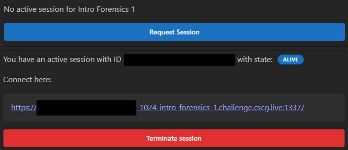
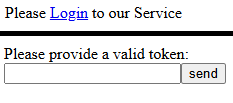
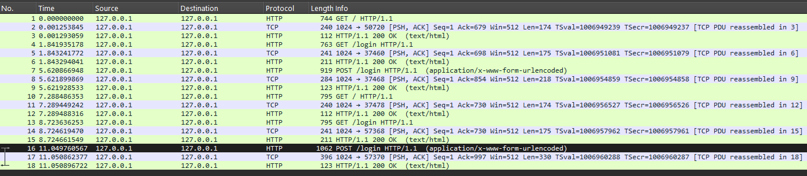
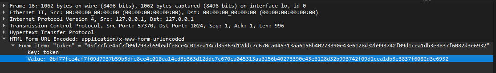
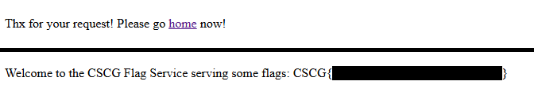

# Intro Forensics 1
- Author: Ilja Ylikangas / ilpakka
- Event: [CSCG 2025](https://play.cscg.live/)

## Details:

- **Category:** Forensics
- **Description:** "First we will learn a little bit about Wireshark. For the beginning just start play around with Wireshark and their filters, look into the protocols and getting familar with the tool. Besides Reverse Engineering skills, recording the network traffic is an important part in the analysis of malware."
- **Attachment:** `intro-forensics-1.zip`

### Overview
We are required to do some **Wiresharking** on `intro-forensics-1.pcapng` which was found inside the attachment file. The file should contain some key information for receiving the flag.

## 1. Session

Let's first request a session and open the provided link after the session state is `ALIVE`. 
 
 
 
We are then greeted by a `Login` screen which asks us to provide a **valid token**. I am fairly certain that we can find this token in `intro-forensics-1.pcapng`. 
 

## 2. **Wireshark**

We need to find the token to access the page. After some searching we notice that at the very bottom the last `POST /login HTTP/1.1` and `HTTP/1.1 200 OK` together reveal that the user successfully managed to access the page. This means that the **value for a valid token** must be inside `POST /login HTTP/1.1`. 
 

## 3. Token and Flag

We copy the token value and go back to the login page. We `send` the token and we are asked to go `home`. Following these instructions reveals a hidden message and the **flag**.
 

 
Now we've successfully found the flag and are able to return it.

---
