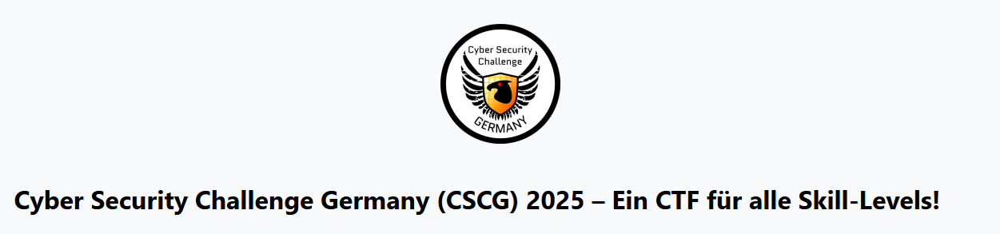

# Cyber Security Challenge Germany (CSCG) 2025

*Welcome to the Cyber Security Challenge Germany (CSCG) 2025. The CSCG is a hacking competition with tasks from various categories of IT security: featuring reverse engineering, binary exploitation, cryptography, web security and miscellaneous. There are exciting challenges for both newcomers and experienced CTF players at various levels of difficulty.* 
 
NOTE: I will only include some writeups from the 'Intro' challenges since the event is still live and doing otherwise would risk disqualification
## Event Details
| Start Date | End Date | Type | Format | Location | Players | Tasks | Link |
|-----------|----------|----------|----------|----------|---------|---------|---------|
| 1 Mar 2025 | 1 May 2025 | Public | Solo | Online | 1000+ | 28 | [CSCG 2025](https://play.cscg.live/) |
