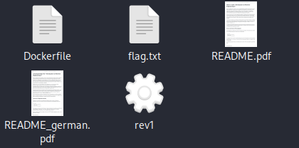
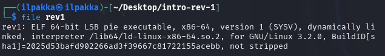
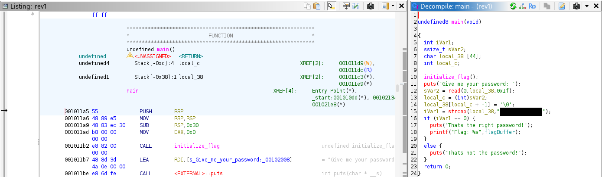
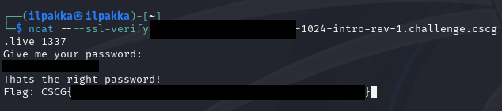

# Intro Reverse Engineering 1
- Author: Ilja Ylikangas / ilpakka
- Event: [CSCG 2025](https://play.cscg.live/)

## Details:

- **Category:** Reverse Engineering
- **Description:** "Let's have a gentle introduction to reverse engineering x86_64 binaries on Linux."
- **Attachment:** `intro-rev-1.zip`

### Overview
We need to find a way to reverse engineer the flag from `rev1` which is found in `intro-rev-1.zip`.

## 1. Session and File

Let's first start the session and check the contents of `intro-rev-1.zip`. 
 
 
 
*Note: If you've never done any reverse engineering then it's also worthwhile to check out the `README.pdf`.* 
 
It seems that we can ignore everything else and focus on `rev1`. We can check what sort of a file we're working with by navigating to the directory in console and entering `file rev1`. 
 
 
 
Now we know our `rev1` file is an **64-bit ELF program (x86-64)**. It's also worth noting that the metadata is still available because we can see `not stripped` at the end of the string.

## 2. Ghidra

We will be using Ghidra to further analyze the file. Ghidra is a very versatile reverse engineering tool developed by the NSA. 
Luckily for us it's been open source for a while now and you are able to download it from the NSA GitHub repository. 
 
*Note: the next steps assume you have Ghidra installed and running. You can follow the official installation guide by NSA or on YouTube if you prefer a visual guide.* 
 
Create a new project, load up our `rev1` file and begin the initial analysis. Once the analysis is complete we can try to search for the **main()** function by pressing `g` followed by `main`. 
 
 
 
Well would you look at that. Not only did we find **main()** but a password is visible in plaintext as part of the **strcmp** function. 
This function compares the `user input` with the stored `password string` and if it returns `0` then the flag is printed. 

## 3. Password and Flag

Now that we know the password, let's copy our session link and run it via the console. 
Once it's asking for the password we enter the one found by analysing `rev1`. 
 
 
 
Great! The password worked and now we can submit our flag.

---
