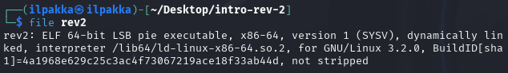
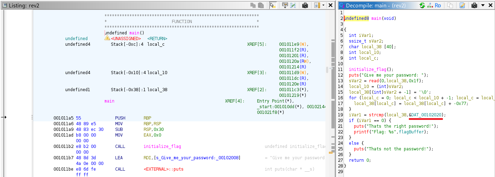
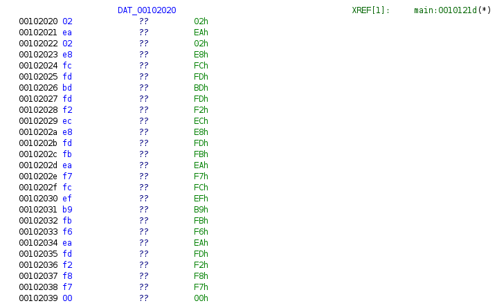
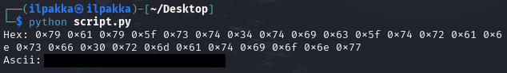
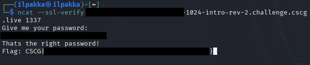

# Intro Reverse Engineering 2
- Author: Ilja Ylikangas / ilpakka
- Event: [CSCG 2025](https://play.cscg.live/)

## Details:

- **Category:** Reverse Engineering
- **Description:** "Somehow the password was encoded and can't be found in plaintext in the binary. Can you still figure out the right password?"
- **Attachment:** `intro-rev-2.zip`

### Overview
Just like in the previous challenge we need to beat the task by reverse engineering `rev2` which is found in `intro-rev-2.zip`.

## 1. Session and File

Let's start the session and check the contents of `intro-rev-2.zip`.<br>
We notice that theres really nothing else of interest save for `rev2`.<br>
Let's focus on that and call `file rev2` in our console.<br>
<br>
<br>
<br>
Once again our file is an **64-bit ELF program (x86-64)**.

## 2. Ghidra

We create a new project and import `rev2` to begin the initial analysis. After the analysis is complete we once again search for the **main()** function by pressing `g` followed by `main`.<br>
<br>
However, this time we notice that something is different.<br>
<br>
<br>
<br>
In the previous challenge our password was visible in plaintext but now it's been replaced by some **data variable address**.<br>
Maybe there is a clever way we can find more information about this.

## 3. DAT_00102020 and 0x77

I noticed that right before **strcmp** the program actually shifts the `local_38` input byte values by ´0x77´.<br>
This means that even if we knew the password we would not be able to use it to get the flag from the session.<br>
```c
for (local_c = 0; local_c < local_10 + -1; local_c = local_c + 1) {
    local_38[local_c] = local_38[local_c] + -0x77;
}
```
<br>
What we need now is to create a script that subtracts `0x77`. But what are we actually subtracting `0x77` from?<br>
<br>
If we just double click `DAT_00102020` it sends us to the address location. Here we can see the stored password character bytes.<br>

<br>
<br>

## 4. Script and Flag

```python
encoded_password = [0x02, 0xEA, 0x02, 0xE8, 0xFC, 0xFD, 0xBD, 0xFD, 0xF2, 0xEC, 0xE8, 0xFD, 0xFB, 0xEA, 0xF7, 0xFC, 0xEF, 0xB9, 0xFB, 0xF6, 0xEA, 0xFD, 0xF2, 0xF8, 0xf7, 0x00]

output = []

for i in encoded_password:
	decoded_password = (i + 0x77) & 0xFF # only include 1 byte sizes
	output.append(decoded_password)
	
print("Hex: " + " ".join(hex(n) for n in output))
print("Ascii: " + "".join(chr(n) for n in output)) # careful, let's not space separate
```
<br>
When we run this script we store the decoded password both in hex and ascii formats.<br>

<br>
<br>
We finally got our DAT_00102020 data in plaintext so now we can just see if it really works!<br>
<br>
<br>
<br>
And it sure does!

---

