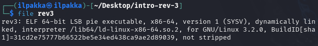
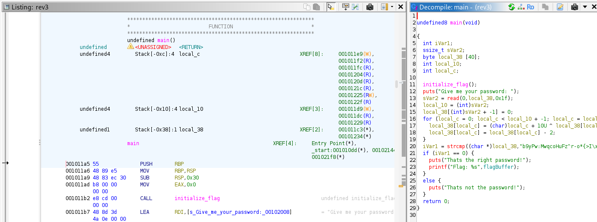
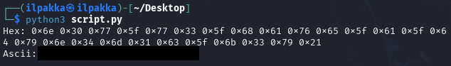
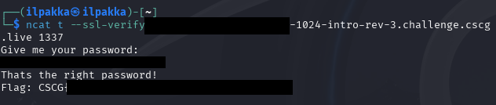

# Intro Reverse Engineering 3
- Author: Ilja Ylikangas / ilpakka
- Event: [CSCG 2025](https://play.cscg.live/)

## Details:

- **Category:** Reverse Engineering
- **Description:** "Again, the password was encoded. But this time your input is transformed dynamically! Is it still possible to find the password?"
- **Attachment:** `intro-rev-3.zip`

### Overview
Just like in the previous challenges we need to beat the task by reverse engineering `rev3` which is found in `intro-rev-3.zip`.

## 1. Session and File

Let's start the session and check the contents of `intro-rev-3.zip`.<br>
We focus on `rev3` and check the file type in our console.<br>
<br>
<br>
<br>

## 2. Ghidra

We follow the steps of the previous challenges and create a new project and import `rev3`. We find the **main()** function once more but now we finally see something new.<br>
<br>
<br>
<br>
Our password is visible, but it's clear that something weird is happening to the way user input is stored before **strcmp**. We need to figure out what exactly is going on.

## 3. Le nozze di Figuring Out

Well it would seem that a few things are happening: bitwise shenanigans and subtraction.
```c
for (local_c = 0; local_c < local_10 + -1; local_c = local_c + 1) {
    local_38[local_c] = (char)local_c + 10U ^ local_38[local_c];
    local_38[local_c] = local_38[local_c] - 2;
}
```
Our task is to find a way to reverse this so let's create a simple script just like in the previous task.<br>

```python
encoded_password = [0x62, 0x39, 0x79, 0x50, 0x77, 0x3A, 0x4D, 0x77, 0x71, 0x63, 0x6F, 0x48, 0x75, 0x46, 0x7A, 0x5E, 0x72, 0x2D, 0x6F, 0x2A, 0x7B, 0x3E, 0x49, 0x10, 0x59, 0x00]

output = []

for i, x in enumerate(encoded_password):
	decoded_password = ((i + 0x0A) ^ (x + 2)) & 0xFF # let's ignore over 1 byte sizes
	output.append(decoded_password)

print("Hex: " + " ".join(hex(n) for n in output))
print("Ascii: " + "".join(chr(n) for n in output)) # no spaces between
```

<br>
<br>
Our script works and we get the correct password! Now all that's left is to check the session.<br>
<br>
<br>
<br>
And there it is! Task completed.

---
