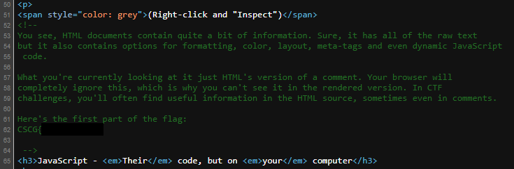
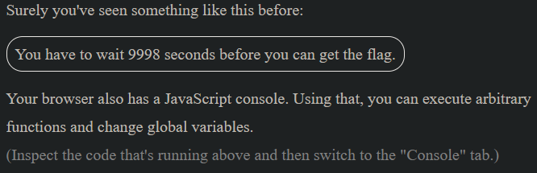
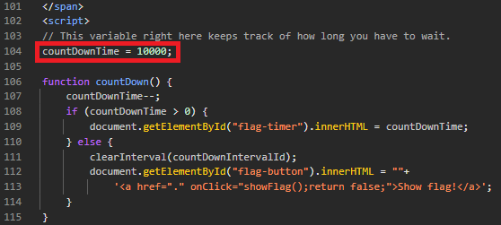
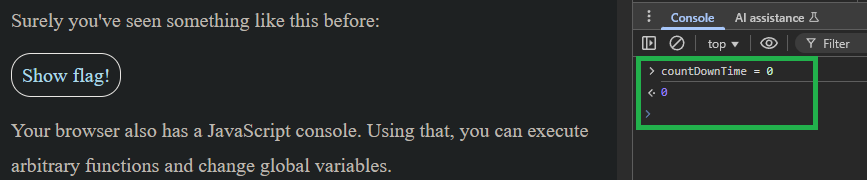
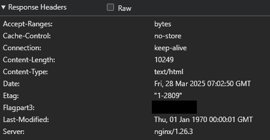

# Intro Web 1
- Author: Ilja Ylikangas / ilpakka
- Event: [CSCG 2025](https://play.cscg.live/)

## Details:

- **Category:** Web
- **Description:** "Prepare yourself, for the web is vast and full of errors."
- **Attachment:** -

### Overview
A very basic challenge where we follow the simple instructions of the main page.

## 1. HTML

Start the session and open the link to access the main page. The main page pretty much works as a writeup itself. 
 
If we inspect the source code we notice that the first part of the flag was hidden in the HTML comments: 
 
 

## 2. Global variables

We notice that there is a timer that began counting down from 10 000 as we opened up the page. 
 
 
 
In order for us to skip the wait and reveal the flag immediately should just find the running script and edit the variable that stores the time. Let's open up the **Developer Tools** and take a look. 
 
 
 
Well there it is. We can change this variable on the fly by using the **Console**. Let's change the `countDownTime` variable to be equal to `0`. 
This updates the script on the main page and now we can just click on the button to get an alert which shows a part of the flag. 
 

 

## 3. Response Headers

The rest of the main page instructs the user to download and use **ZAP** to reveal the remainder of the flag but this is not necessary. 
By reading the instructions we are hinted that the flag should be found somewhere in the request responses. 
 
We can actually check the headers on the **Network** tab on our **Developer Tools**. 
 

 
Nice. Now we have the full flag and are ready to submit it.

---
