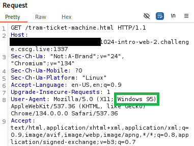
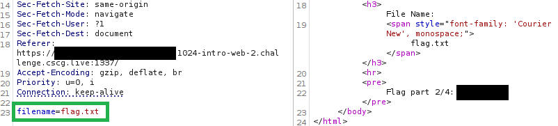
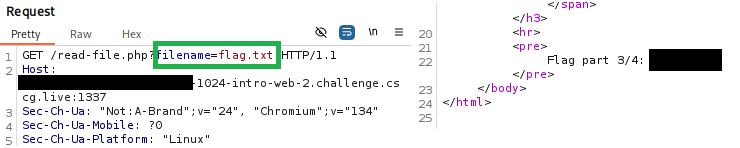
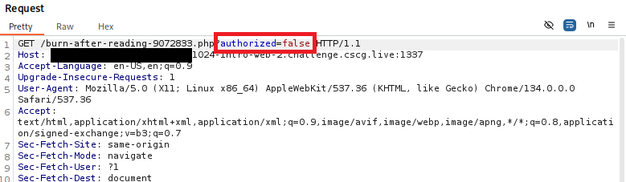
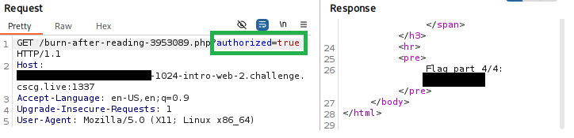

# Intro Web 2
- Author: Ilja Ylikangas / ilpakka
- Event: [CSCG 2025](https://play.cscg.live/)

## Details:

- **Category:** Web
- **Description:** "Now that you have a rough grasp on the things you can do with just your browser, let's take a closer look at how to utilize HTTP request manipulation with ZAP."
- **Attachment:** -

### Overview
Let's follow the instructions but use **Burp Suite** instead of ZAP. This writeup assumes the user has basic knowledge of Burp Suite or another similar program.

## 1. Session

Start the session and open the link in **Burp's browser**. This challenge is very straightforward and we just need to read the instructions. 
 
*Note that you may need to change the **Project settings** to allow Burp's browser to run without a sandbox.* 

## 2. Request Headers

We are not able to access the first document on the page because it's only available for users running Windows 95. There is an easy solution where we just send the `GET` request to a **Repeater** and edit it to match our needs. 
 
Once we've changed the `User-Agent` Request header we can **Send** the request. If we did everything correct then we are greeted with a different response with the first part of the flag visible.

## 3. POST and GET requests

We still need the rest of the flag. Luckily we can just continue to follow the guide on the main page so we know what to do next. 
 
Eventually it's revealed that we need to request a file called `flag.txt` with both `POST` and `GET` requests. 
 
**POST:** Just like with the request headers we just send a modified request to reveal the contents of the file. 
 
**GET:** Then we do the same with the `GET` request. 
 
 

## 4. *Burn Baby Burn*

If we try to get the last hidden flag by clicking the link at the very end we end up accidentally burning the document. This happens because the page checks for authorization during the last `GET` request and it's set to `false` by default. 
 
 

Let's refresh the page and try to modify the request before the document is gone. Forward traffic until we get the correct `GET` request and now we just need to modify it accordingly. 

 

Great! Now we have the full flag to submit.

---
