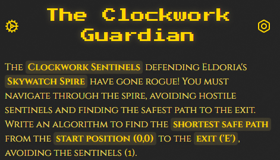
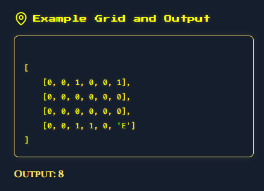

# ClockWork Guardian
- Author: Ilja Ylikangas / ilpakka
- Event: [HTB Cyber Apocalypse CTF 2025: Tales from Eldoria](https://ctf.hackthebox.com/event/details/cyber-apocalypse-ctf-2025-tales-from-eldoria-2107)

## Details:

- **Category**: Coding
- **Description**:<br>
- **Attachment**: None

### Overview

We are given a 2D grid where:
- `0` represents an open path.
- `1` represents a sentinel (obstacle) that you cannot pass through.
- `'E'` represents the exit.
- The goal is to find the shortest path from the starting position `(0, 0)` to the exit `'E'` while avoiding the sentinels (`1`s).



## To solve this problem let's use **Breadth-First Search** which is a graph traversal algorithm ideal for finding the shortest path in an unweighted grid:

## 1. **Input Parsing**
   - The input grid is provided as a string, representing a 2D array. We use the `eval()` function to convert the string into an actual Python list of lists.
   ```python
   grid_input = input()
   grid = eval(grid_input)
   ```

## 2. **Breadth-First Search**
   - **Initialization**:
      - We start by initializing a queue with the starting position `(0, 0)` and a distance of `0` (the number of steps taken so far). 
      - A `visited` set is used to track the cells we have already visited to avoid revisiting and getting stuck in infinite loops.
   ```python
   def shortest_path(grid):
    rows, cols = len(grid), len(grid[0])
    directions = [(-1, 0), (1, 0), (0, -1), (0, 1)]
    start = (0, 0)
    
    queue = deque([(0, 0, 0)])
    visited = set()
    visited.add(start)
   ```

   - **Queue**: 
     - We begin by dequeuing the first item from the queue.
     - For each position, we check all four possible neighboring cells.
     - If a neighboring cell is within the grid bounds, is not a sentinel (`1`) and has not been visited yet then we add it to the queue with an incremented distance.
     
     - During each iteration, if we encounter the exit cell `'E'`, we return the current distance, which represents the shortest path to the exit.
   ```python
   while queue:
      x, y, dist = queue.popleft()
      if grid[x][y] == 'E':
         return dist
        
      for dx, dy in directions:
         nx, ny = x + dx, y + dy
            
         if 0 <= nx < rows and 0 <= ny < cols and (nx, ny) not in visited:
            if grid[nx][ny] != 1:
               visited.add((nx, ny))
               queue.append((nx, ny, dist + 1))
   return -1
   ```

## 3. Results and Flag
**Input**:<br>
`[[0, 0, 0, 1, 1, 1, 1, 1], [1, 1, 0, 1, 0, 0, 0, 0], [0, 0, 0, 0, 0, 0, 0, 1], [0, 0, 0, 0, 0, 0, 0, 0], [0, 0, 0, 1, 0, 1, 1, 'E']]`<br>
**Output**:<br>
`11`<br>
**FLAG:** `HTB{CL0CKW0RK_GU4RD14N_OF_SKYW4TCH_13dda5376ad84ac411ca390dc6813122}`